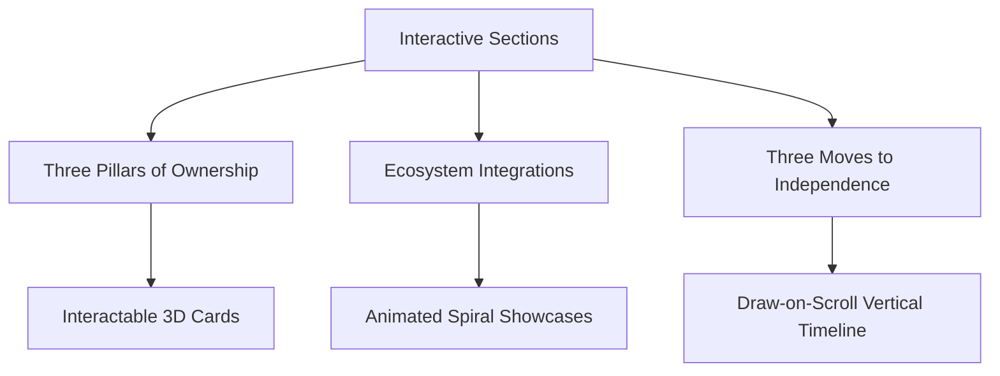

# ♟️ XLChess — Creator-Owned Chess Platform Infrastructure

> **Build, Brand, and Scale Your Own Chess Platform.** A white-label, production-ready chess infrastructure allowing chess creators, coaches, and academies to launch their own branded experience, monetize directly, and grow independently.

---

## 🌟 Major Design & UX Overhaul (Premium Aesthetics)

We have completely redesigned the visual identity of XLChess, transitioning it from a standard layout into a premium, luxury web application. The design uses high-contrast typography, interactive state elements, and smooth cinematic animations.

### 🎨 Premium Dark & Golden Theme
*   **Color System:** Shifted from standard dark blue to **Obsidian Dark & Gold** (`#080B14` deepest background, `#0C1020` surface layers, `#D4AF6E` primary luxury gold, and `#F5F0E8` warm ivory). Configured inside [tailwind.config.js](file:///c:/Users/Harsh/Documents/GitHub/Chess-Project/tailwind.config.js).
*   **Rook Animation Loader:** A tailored website preloader featuring a breathing Rook silhouette combined with a precision percentage counter ($0\%$ to $100\%$) and cinematic phase descriptors that prepare the user experience.
*   **Golden Interactive Hovers:** Dynamic button hover transitions built specifically for desktop users, featuring animated gold borders, sliding background overlays, and glowing drop shadows.
*   **Interactive Particle Engine:** Custom-built interactive canvas drawing chess-themed coordinate coordinates and microparticles that fluidly trail the cursor position all across the screen.

### ✍️ Brand Typography
We replaced default browser sans-serif layouts with a curated editorial typographic suite:
*   **Display Headers:** **Cormorant Garamond** — a premium, elegant serif font giving a classic, luxury chess journal aesthetic.
*   **Body & Interface Copy:** **Inter** — optimized for high readability, clean spacing, and structural geometry.
*   **Game Notation & Codes:** **DM Mono** — a clean, monospace system providing pixel-perfect chessboard coordinate mapping and analytics logging.

### 🧭 Elevated Navigation Flows
*   **Adaptive Header:** Built a modern responsive navigation bar in [Navbar.tsx](file:///c:/Users/Harsh/Documents/GitHub/Chess-Project/src/components/Navbar.tsx) that seamlessly collapses into a mobile hamburger navigation grid.
*   **Smooth Scroll Routing:**
    *   **Live Demo:** Clicking redirects smoothly to the pilot signup form at the bottom.
    *   **View Puzzle:** Scrolls directly to the hero interactive board and highlights the active checkmate challenge.
*   **Confetti Victory Overlay:** Solving the interactive checkmate puzzle triggers a full-screen confetti explosion (powered by a custom `useConfetti.ts` hook) and a luxurious victory overlay celebrating the solution.

---

## ⚡ Interactive Scroll-Driven Reveal Sections

We introduced three brand new, scroll-reveal landing page components using GSAP ScrollTrigger timelines.



### 1. Three Pillars of Ownership
*   **Path:** [Features.tsx](file:///c:/Users/Harsh/Documents/GitHub/Chess-Project/src/components/Features.tsx) (Section ID: `why-ownership`)
*   **Details:** Highlights the core values of owning your audience, platform control, and monetization independence.
*   **Interactivity:** Uses staggered GSAP entry animations. Desktop users can hover over individual cards to trigger a realistic 3D perspective tilt effect (`rotateX` and `rotateY` following coordinate physics).

### 2. Ecosystem Integrations Showcase
*   **Path:** [Integrations.tsx](file:///c:/Users/Harsh/Documents/GitHub/Chess-Project/src/components/Integrations.tsx) (Section ID: `integrations`)
*   **Details:** Displays connection options for external tooling (YouTube, Discord, Stripe, Notion, Figma, Google Workspace).
*   **Interactivity:** Features a central brand emblem surrounded by concentric, animated conic-gradient orbits that continuously spin and reveal integration vectors.

### 3. Three Moves to Independence
*   **Path:** [HowItWorks.tsx](file:///c:/Users/Harsh/Documents/GitHub/Chess-Project/src/components/HowItWorks.tsx) (Section ID: `how-it-works`)
*   **Details:** Outlines onboarding steps (Customize → Integrate → Launch).
*   **Interactivity:** Built a dynamic, vertical timeline connector path. As the page scrolls, ScrollTrigger draws a glowing gold connector line down the steps while sequentially fading and sliding cards into view.

---

## 🚀 Production-Ready Optimizations

Apart from visual changes, XLChess is fully optimized for web crawlers, search ranking, social distribution, performance, and screen accessibility.

### 🔍 Technical SEO & Accessibility Fixes
*   **Semantic Structure:** Restructured header levels to enforce a strict **Single `<h1>` Tag** rule across the page, ensuring optimal crawl validation.
*   **Aria Landmark Compliance:** Added proper role descriptors, mobile menu expansion maps (`aria-expanded`, `aria-controls`), and footer `<nav>` attributes.
*   **Keyboard Navigation (a11y):** Integrated `tabIndex={0}` focus markers and `Enter`/`Space` listener key-binds on all custom visual click triggers (e.g. logos and interactive headers).

### 🤖 Global Indexing Assets
*   **Robots Rulebook:** Created [robots.txt](file:///c:/Users/Harsh/Documents/GitHub/Chess-Project/public/robots.txt) to explicitly list allowable crawler paths, block internal directories (`/.git/`, `/src/`), and define sitemap references.
*   **XML Sitemap:** Created [sitemap.xml](file:///c:/Users/Harsh/Documents/GitHub/Chess-Project/public/sitemap.xml) mapping active Vercel pages to quicken search engine parsing.
*   **PWA Manifest:** Added [site.webmanifest](file:///c:/Users/Harsh/Documents/GitHub/Chess-Project/public/site.webmanifest) outlining standalone display parameters, theme colors, background fills, and maskable high-definition icon indices for mobile users.

### 🏷️ Meta Tag Engine
*   **Open Graph (OG) Suite:** Added standard Facebook/WhatsApp/LinkedIn metadata tags (such as `og:type`, `og:title`, `og:image`, `og:url`) to index professional, high-resolution previews when links are shared.
*   **Twitter / X Cards:** Configured standard `twitter:card`, `twitter:site`, and dynamic preview image tags.
*   **Canonical Mapping:** Added absolute link canonical references to prevent index penalties from duplicate domains.
*   **JSON-LD Structured Schema:** Embedded a complete, nested schema mapping the relationships between the `Organization`, `WebSite`, and `WebPage` nodes to provide machines with rich context.

### ⚡ Performance & Core Web Vitals
*   **Asset Preconnections:** Configured DNS handshakes (`preconnect`, `dns-prefetch`) for Google Fonts services, Google Tag Manager endpoints, and form handlers.
*   **Fetch Prioritizations:** Added `fetchPriority="high"` on critical layout elements (hero brand images) and configured `loading="lazy"` on lower sections to achieve higher Largest Contentful Paint (LCP) performance scores.

---

## 📊 Enterprise GTM + GA4 Analytics Suite

To gather deep behavioral insights, we implemented a strongly-typed, scalable analytics architecture under [src/analytics/](file:///c:/Users/Harsh/Documents/GitHub/Chess-Project/src/analytics).

> [!NOTE]
> All tracking utilizes asynchronous queues to ensure Google Tag Manager scripts initialize asynchronously without blocking frame-rendering or UI threads.

### 🛠️ Architecture Layout
```
src/analytics/
├── index.ts        # Public API Barrel File (consumers import from here)
├── types.ts        # Strict TypeScript schemas representing 50+ event structures
├── constants.ts    # Single source of truth catalog for event names and labels
├── gtm.ts          # Asynchronous Tag Manager script injection
├── events.ts       # Central trackEvent() processor & window.dataLayer publisher
├── pageView.ts     # Virtual page tracking handler for SPA platforms
├── scrollDepth.ts  # RAF-throttled scroll depth observer hook
└── useAnalytics.ts # Lifecycle hook tracking page renders and scroll markers
```

### 🛰️ Central Tracker Core Details
*   **Automatic Metadata Enrichment:** Every event pushed onto `window.dataLayer` automatically appends client device context:
    *   `timestamp`: Precision ISO 8601 string.
    *   `page`: Active URL pathname + search query string.
    *   `device_type`: Resolved to `desktop`, `tablet`, or `mobile` based on window width.
    *   `viewport`: Pixel dimensions of the current window (e.g. `1920x1080`).
*   **Scroll Depth Tracking:** Custom React hook tracks scroll markers at $25\%$, $50\%$, $75\%$, and $100\%$ thresholds. This uses `requestAnimationFrame` to prevent thread locking, recording which specific section was viewable at that milestone.
*   **Local Developer Logging:** In development mode, analytics events print formatted tables directly to the developer console for debugging. These logs are automatically stripped from production builds.

### 🏷️ Custom Interactivity Events
We mapped events to every component across the user journey:

| Category | Event Name | Captured Properties / Context |
| :--- | :--- | :--- |
| **Session & Navigation** | `page_view`, `mobile_menu_open`, `navbar_link_click` | Button label, navigation destination, layout state |
| **Section Visibility** | `section_viewed`, `feature_card_viewed` | Section ID, section name, card labels |
| **Lead Generation Form** | `contact_form_started`, `contact_form_field_focus`, `contact_form_validation_error`, `contact_form_submit_success` | Field focused, validation errors (e.g. invalid email), submission outcomes |
| **Chess Puzzle Challenge** | `puzzle_started`, `puzzle_move_played`, `hint_used`, `puzzle_completed`, `puzzle_failed` | Turn coordinate, solution outcome, mate check states, hint tracking |
| **AI Stockfish Engine** | `game_started`, `difficulty_selected`, `move_played`, `move_undone`, `engine_analysis_opened`, `game_over` | Board configurations, AI tier (Beginner to Master), analysis options, game conclusions |

---

## 🛠️ Core Technology Stack

*   **Front-End Framework:** React 19, Vite, TypeScript
*   **Styles Engine:** Tailwind CSS v3, PostCSS, Autoprefixer
*   **Chess Logic:** Stockfish JS (compiled via WASM/Emscripten and loaded on a native background worker thread), `chess.js`, and `react-chessboard`.

---

## ⚙️ Technical Architecture & Core Engine

### CORS-Safe CDN Stockfish Hook
The engine utilizes a custom React hook `useStockfish.ts` to instantiate Stockfish on a native browser background worker without local file caching or origin issues:
```typescript
const blobCode = `importScripts("https://cdnjs.cloudflare.com/ajax/libs/stockfish.js/10.0.2/stockfish.js");`;
const blob = new Blob([blobCode], { type: 'application/javascript' });
const workerUrl = URL.createObjectURL(blob);
const worker = new Worker(workerUrl);
```

### Universal Chess Interface (UCI) Parser
Monitors outputs from the background threads to translate centipawn score weights (+10 to -10 range) relative to White, plotting real-time advantages on the vertical HTML evaluation bar:
```typescript
const scoreMatch = line.match(/score (cp|mate) (-?\d+)/);
if (scoreMatch) {
  const type = scoreMatch[1];
  let value = parseInt(scoreMatch[2], 10);
  if (isBlackTurn) value = -value; // Convert perspective to White
}
```

---

## 💻 Local Installation & Setup

1.  **Clone the repository:**
    ```bash
    git clone https://github.com/CHANDRAHARSHIT/Chess-Project.git
    cd Chess-Project
    ```
2.  **Install project dependencies:**
    ```bash
    npm install
    ```
3.  **Configure environment files:**
    Create a local environment file `.env` and assign your container/analytics credentials:
    ```env
    VITE_CONTACT_EMAIL=contact@yourbrand.com
    VITE_GTM_CONTAINER_ID=GTM-MKLN6W4R
    VITE_GA4_MEASUREMENT_ID=G-41HHH0E1NF
    ```
4.  **Launch local developer server:**
    ```bash
    npm run dev
    ```
5.  **Compile production bundle:**
    ```bash
    npm run build
    ```
